# 📘 Detalhamento das Classes

## 

---

## 🧍‍♂️ Classe `Usuario`
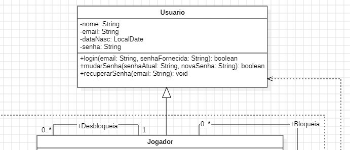

**Atributos:**
- `nome: String`
- `email: String`
- `dataNasc: LocalDate`
- `senha: String`

**Métodos:**
- `login(email: String, senha: String): boolean`
- `modificarSenha(senhaAtual: String, novaSenha: String): boolean`
- `recuperarSenha(email: String): void`

**Relacionamentos:**
- Herança: `Jogador` herda de `Usuario`
- Associado à `ServicoDeUsuario` (dependência)

---

## 🧑‍💻 Classe `Jogador`
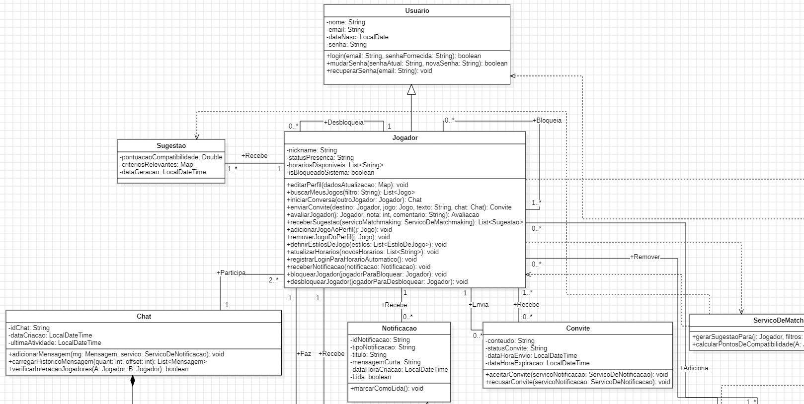

**Atributos:**
- `nickname: String`
- `statusPresenca: String`
- `horariosDisponiveis: List`
- `isBloqueadoSistema: boolean`

**Métodos:**
- `editarPerfil(dadosAtualizacao: Map): void`
- `buscarMeusJogos(filtro: String): List`
- `iniciarConversa(outroJogador: Jogador): Chat`
- `enviarConvite(destino: Jogador, jogo: Jogo, texto: String, chat: Chat): Convite`
- `receberSugestao(servicoMatchmaking: ServicoDeMatchmaking): List`
- `adicionarJogoAoPerfil(j: Jogo): void`
- `removerJogoDoPerfil(j: Jogo): void`
- `definirEstilosDeJogo(estilos: List): void`
- `atualizarHorarios(novosHorarios: List): void`
- `registrarLoginParaHorarioAutomatico(): void`
- `receberNotificacao(notificacao: Notificacao): void`
- `bloquearJogador(jogadorParaBloquear: Jogador): void`
- `desbloquearJogador(jogadorParaDesbloquear: Jogador): void`

**Relacionamentos:**
- Envia/recebe `Convites`, `Notificações`, `Avaliações`, `Mensagens`
- Participa de `Chats`
- Associado ao `ServicoDeMatchmaking`

---

## 💬 Classe `Chat`
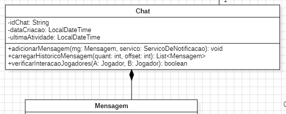

**Atributos:**
- `idChat: String`
- `dataCriacao: LocalDateTime`
- `ultimaAtividade: LocalDateTime`

**Métodos:**
- `adicionarMensagem(mg: Mensagem, servico: ServicoDeNotificacao): void`
- `carregarHistoricoMensagem(quant: int, offset: int): List`
- `verificarInteracaoEntreJogadores(A: Jogador, B: Jogador): boolean`

**Relacionamentos:**
- Contém múltiplas `Mensagem`
- Mínimo 2 `Jogadores` participantes

---

## ✉️ Classe `Mensagem`
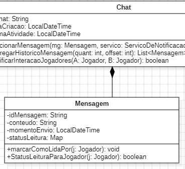

**Atributos:**
- `idMensagem: String`
- `conteudo: String`
- `momentoEnvio: LocalDateTime`
- `statusLeitura: Map`

**Métodos:**
- `marcarComoLida(j: Jogador): void`
- `statusLeituraParaJogador(j: Jogador): boolean`

---

## 🤝 Classe `Convite`
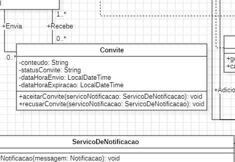

**Atributos:**
- `conteudo: String`
- `statusConvite: String`
- `dataHoraEnvio: LocalDateTime`
- `dataHoraExpiracao: LocalDateTime`

**Métodos:**
- `aceitarConvite(servicoNotificacao: ServicoDeNotificacao): void`
- `recusarConvite(servicoNotificacao: ServicoDeNotificacao): void`

---

## 📩 Classe `Notificacao`
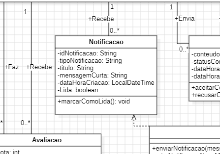

**Atributos:**
- `idNotificacao: String`
- `tipoNotificacao: String`
- `titulo: String`
- `mensagemCurta: String`
- `dataHoraCriacao: LocalDateTime`
- `Lida: boolean`

**Métodos:**
- `marcarComoLida(): void`

---

## 🌟 Classe `Sugestao`
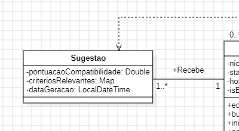

**Atributos:**
- `pontuacaoCompatibilidade: Double`
- `criteriosRelevantes: Map`
- `dataGeracao: LocalDateTime`

**Relacionamentos:**
- Gerada por `ServicoDeMatchmaking`

---

## 🌟 Classe `Avaliacao`
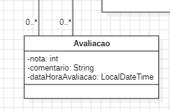

**Atributos:**
- `nota: int`
- `comentario: String`
- `dataHoraAvaliacao: LocalDateTime`

**Relacionamentos:**
- Enviada de um `Jogador` para outro

---

## ⚙️ Classe `ServicoDeMatchmaking`
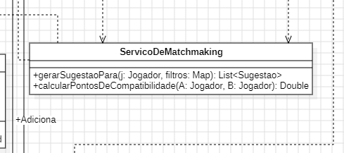

**Responsabilidades:**
- Gerar sugestões de partidas entre jogadores

**Métodos:**
- `gerarSugestoesPara(j: Jogador, filtros: Map): List`
- `calcularPontosDeCompatibilidade(A: Jogador, B: Jogador): Double`

**Relacionamentos:**
- Associada ao `Sistema` e `Jogador` (dependência)

---

## 📤 Classe `ServicoDeNotificacao`
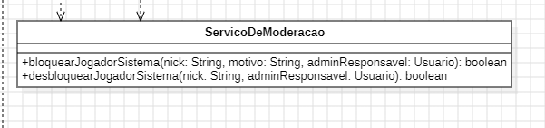

**Métodos:**
- `enviarNotificacao(mensagem: Notificacao): void`
- `criarNotificaoNovaMensagem(c: Chat, m: Mensagem, j: Jogador): Notificacao`

**Relacionamentos:**
- Associada ao `Sistema` (dependência)

---

## ⚙️ Classe `ServicoDeUsuario`

**Métodos:**
- `cadastrarUsuario(dados: Map): Usuario`
- `autenticarUsuario(email: String, senha: String): Object`
- `solicitarRecuperacaoSenha(email: String): void`

**Relacionamentos:**
- Associada ao `Sistema` e `Usuario` (dependência)

---

## 👮‍♀️ Classe `ServicoDeModeracao`
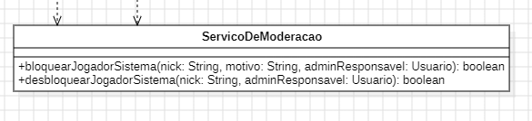

**Métodos:**
- `bloquearJogadorSistema(nick: String, motivo: String, adminResponsavel: Usuario): boolean`
- `desbloquearJogadorSistema(nick: String, adminResponsavel: Usuario): boolean`

**Relacionamentos:**
- Associada ao `Sistema` e `Jogador` (dependência)

---

## 🎮 Classe `Jogo`
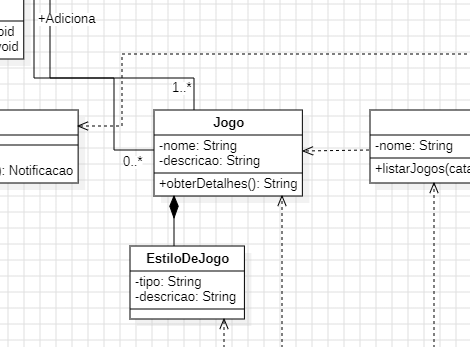

**Atributos:**
- `nome: String`
- `descricao: String`

**Métodos:**
- `obterDetalhes(): String`

**Relacionamentos:**
- Associada à `Plataforma` (dependência)

---

## 🎮 Classe `EstiloDeJogo`
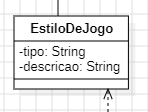

**Atributos:**
- `tipo: String`
- `descricao: String`

**Relacionamentos:**
- Associada ao `Jogo` (dependência)

---

## 🕹️ Classe `Plataforma`
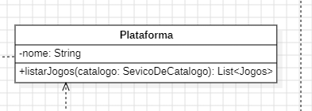

**Atributos:**
- `nome: String`

**Métodos:**
- `listarJogos(catalogo: ServicoDeCatalogo): List`

**Relacionamentos:**
- Associada a múltiplos `Jogos`

---

## 🗂️ Classe `ServicoDeCatalogo`
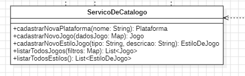

**Métodos:**
- `cadastrarNovaPlataforma(nome: String): Plataforma`
- `cadastrarNovoJogo(dadosJogo: Map): Jogo`
- `cadastrarNovoEstiloJogo(tipo: String, descricao: String): EstiloDeJogo`
- `listarTodosJogos(filtros: Map): List`
- `listarTodosEstilos(): List`

**Relacionamentos:**
- Associada ao `Sistema`, `Plataforma`, `Jogo` e `EstiloDeJogo`

---

## 🧠 Classe `Sistema`

**Atributos:**
- `servicoUsuario: ServicoDeUsuario`
- `servicoJogador: ServicoDeJogador`
- `servicoMatchmaking: ServicoDeMatchmaking`
- `servicoNotificacao: ServicoDeNotificacao`
- `servicoCatalogo: ServicoDeCatalogo`
- `servicoModeracao: ServicoDeModeracao`

**Relacionamentos:**
- Associada a todas as classes de Serviço

---

## ✅ Classe `ServicoDoJogador`
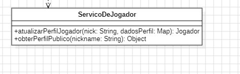

**Métodos:**
- `atualizaPerfilJogador(nick: String, dadosPerfil: Map): Jogador`
- `obterPerfilPublico(nickname: String): Object`

**Relacionamentos:**
- Associada ao `Sistema` e `Jogador`
