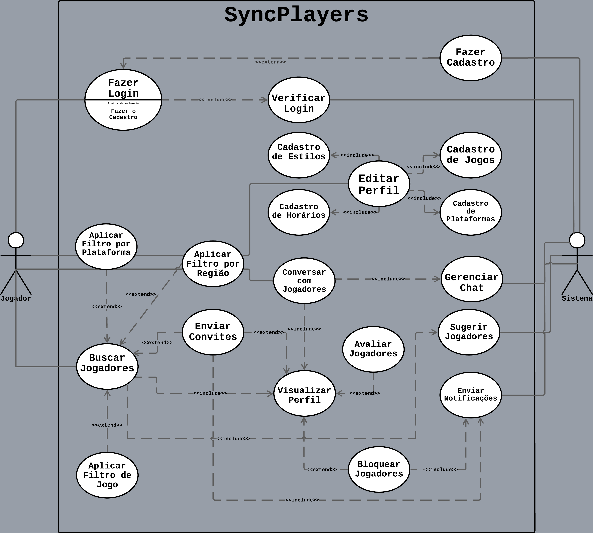
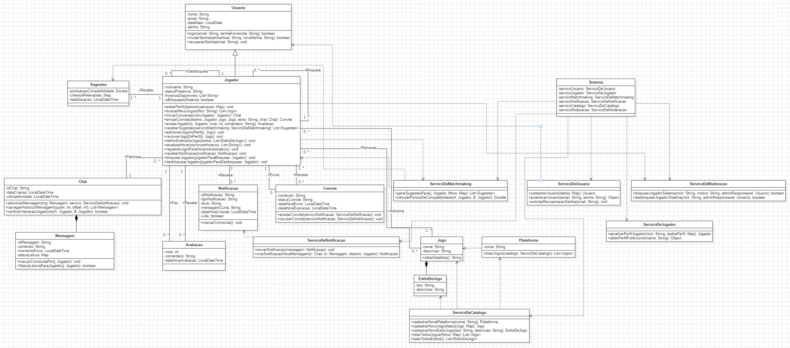
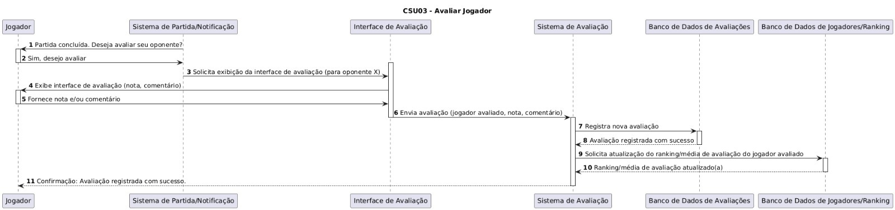
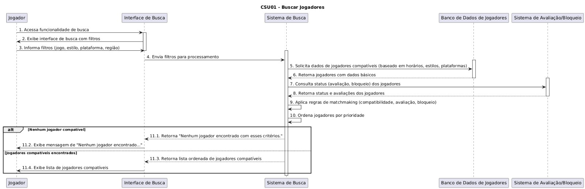
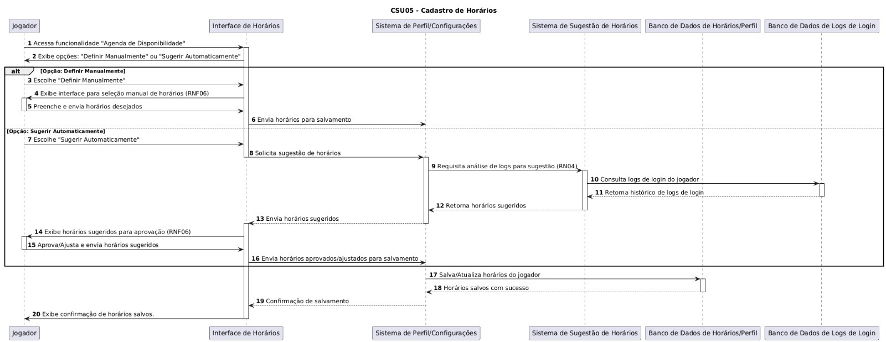

# [📊 Diagramas UML do Sistema](.)

> Visão Geral

## [DIAGRAMA DE CASOS DE USO (PNG)](DiagramaCasodeUso/casosdeusobgwhite.png)

## 

> Ferramenta: LucidChart

> ### [Detalhamento dos Casos de Uso](./DiagramaCasodeUso/CasosUsoDescricao.md)

| Nome                   | Ator    | Descrição breve                        |
| ---------------------- | ------- | -------------------------------------- |
| Fazer Login            | Jogador | Permite acesso ao sistema              |
| Fazer Cadastro         | Jogador | Permite acesso ao sistemas             |
| Editar Perfil          | Jogador | Permite inserir informações no sistema |
| Buscar Jogadores       | Jogador | Permite integração entre usuários      |
| Visualizar Perfil      | Jogador | Permite obter informações de usuários  |
| Verificar Login        | Sistema | Permite validar o acesso ao sistema    |
| Cadastrar Jogos        | Jogador | Permite listar preferências            |
| Cadastrar Estilos      | Jogador | Permite listar preferências            |
| Cadastrar Horários     | Jogador | Permite listar preferências            |
| Cadastrar Plataformas  | Jogador | Permite listar preferências            |
| Filtrar por Plataforma | Jogador | Permite selecionar preferências        |
| Filtrar por Região     | Jogador | Permite selecionar preferências        |
| Filtrar por Jogos      | Jogador | Permite selecionar preferências        |
| Enviar Convites        | Jogador | Permite comunicação entre usuários     |
| Conversar com Jogadores| Jogador | Permite comunicação entre usuários     |
| Avaliar Jogadores      | Jogador | Permite rankear usuários               |
| Bloquear Jogadores     | Jogador | Permite gerenciar preferências         |
| Sugerir Jogadores      | Sistema | Permite integração entre usuários      |
| Gerenciar Chat         | Sistema | Permite boa experiência ao usuário     |
| Eviar Notificações     | Sistema | Permite integração entre usuários      |

 

## 🔹 [DIAGRAMA DE ATIVIDADE](./DiagramaDeAtividade/AtividadesDescricao.md)

### Fluxo de Ações

> Ferramenta: LucidChart

> ### [Detalhamento das Ações](./DiagramaDeAtividade/AtividadesDescricao.md)

| Nome                                                                         | Obs                               |
| ---------------------------------------------------------------------------- | --------------------------------- |
| [Buscar Jogadores](./DiagramaDeAtividade/buscarjogadores.png)                | Filtro, Sugestões e Notificações  |
| [Editar Perfil](./DiagramaDeAtividade/editarperfil.png)                      | Preferências                      |
| [Acessar](./DiagramaDeAtividade/acesso.png)                                  | Cadastro, Login                   |
| [Enviar Mensagem](./DiagramaDeAtividade/enviarmensagem.png)                  | Chat                              |
| [Enviar Notificação](./DiagramaDeAtividade/enviarnotificacao.png)            | Notificação                       |
| [Vizualizar Perfil](./DiagramaDeAtividade/DiagramaDeATVvisualizarPerfil.png) | Vizualização, Bloqueio, Avaliação |

 

## 🔹 [DIAGRAMA DE CLASSES](./DiagramaDeClasse/ClassesDescricao.md)

## 

### Abstração das Entidades

> Ferramenta: StarUML

> ### [Descrição das Classes](./DiagramaDeClasse/ClassesDescricao.md)

| Classes                | Métodos (Exemplos)                              |
| ---------------------- | ----------------------------------------------- |
| Usuário                | Login, Mudar Senha, Recuperar Senha             |
| Jogador                | Editar Perfil, Buscar Meus Jogos                |
| Sugestão               | Pontuação de Compatibilidade                    |
| Chat                   | Adicionar Mensagem                              |
| Mensagem               | Status de Leitura Para Jogador                  |
| Avaliação              |                                                 |
| Notificação            | Marcar Como Lida                                |
| Convite                | Aceitar Convite, Recusar Convite                |
| Serviço de Notificação | Enviar Notificação                              |
| Serviço de Matchmaking | Gerar Sugestão Para                             |
| Jogo                   | Obter Detalhes                                  |
| Estilo de Jogo         |                                                 |
| Serviço de Catalogo    | Listar Todos Jogos, Cadastrar Nova Plataforma   |
| Plataforma             | Listar Jogos                                    |
| Serviço de Usuário     | Cadastrar Usuário, Autenticar Usuário           |
| Serviço de Jogador     | Atualizar Perfil Jogador                        |
| Sistema                | Serviço Usuário, Serviço Jogador                |
| Serviço de Moderação   | Bloquear Jogador Sistema                        |

 

## 🔹 [DIAGRAMA DE ESTADOS](./DiagramaDeEstados/EstadosDescricao.md)

### Possíveis Estados e suas Respectivas Transições

> Ferramenta: LucidChart

> ### [Descrição dos Estados](./DiagramaDeEstados/EstadosDescricao.md)

| Estados                                                             | Transições                                           |
| ------------------------------------------------------------------- | ---------------------------------------------------- |
| [Acesso ao Sistema](./DiagramaDeEstados/Acesso%20ao%20Sistema.png)  | Filtro, Sugestão e Notificação                       |
| [Buscar Jogadores](./DiagramaDeEstados/Buscar%20Jogadores.png)      | Filtro, Sugestão, Vizualização, Convite, Notificação |
| [Enviar Mensagem](./DiagramaDeEstados/Enviar%20Mensagem.png)        | Mensagem, Notificação                                |
| [Vizualizar Perfil](./DiagramaDeEstados/Visualizar%20Perfil.png)    | Vizualização, Funções                                |

 

## 🔹 [DIAGRAMA DE SEQUENCIA](./DiagramaDeSequencia/readme.md)

### • [Avaliar Jogador](./DiagramaDeSequencia/avaliarjogador.jpg)
##   
### • [Bloquear Jogador](./DiagramaDeSequencia/bloquearjogador.jpg)
##   
### • [Buscar Jogadores](./DiagramaDeSequencia/buscarjogadores.jpg)
##   
### • [Cadastrar Horários](./DiagramaDeSequencia/cadastrohorarios.jpg)
##   

 

## 🔹 [DIAGRAMA DE COMPONENTES](./DiagramaDeComponente/readme.md)

##   

| Componentes            | Drescrição                   |
| ---------------------- | ---------------------------- |
| FrontEnd               | Interface Usuário Aplicação  |
| BackEnd                | Máquina Lógica               |
| Serviço Externo        | Consumo de APIs              |
| Banco de Dados         | Armazenamento                |
